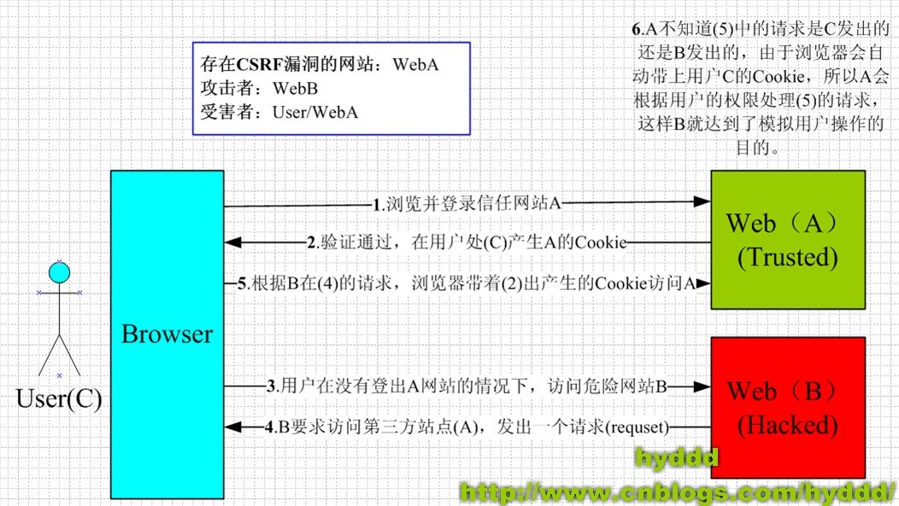

# 1. CSRF概念及原理

## 1.1 CSRF概念

CSRF: 跨站点请求伪造(Cross—Site Request Forgery)，攻击者盗用了你的身份，以你的名义发送恶意请求，对服务器来说这个请求是完全合法的，但是却完成了攻击者所期望的一个操作，比如以你的名义发送邮件、发消息，盗取你的账号，添加系统管理员，甚至于购买商品、虚拟货币转账等。 


## 1.2 CSRF 攻击原理

例如：其中Web A为存在CSRF漏洞的网站，Web B为攻击者构建的恶意网站，User C 为Web A网站的合法用户。



### 攻击步骤

从上图可以看出，要完成一次CSRF攻击，受害者必须依次完成两个步骤：

* 1.登录受信任网站A，并在本地生成Cookie

* 2.在不登出A的情况下，访问危险网站B

看到这里，你也许会说：“如果我不满足以上两个条件中的一个，我就不会受到CSRF的攻击”。是的，确实如此，但你不能保证以下情况不会发生：

* 1.你不能保证你登录了一个网站后，不再打开一个tab页面并访问另外的网站

* 2.你不能保证你关闭浏览器了后，你本地的Cookie立刻过期，你上次的会话已经结束。(事实上，关闭浏览器不能结束一个会话，但大多数人都会错误的认为关闭浏览器就等于退出登录/结束会话了......)

* 3.上图中所谓的攻击网站，可能是一个存在其他漏洞的可信任的经常被人访问的网站


## 1.3 CSRF 攻击案例

### 案例1: GET请求来完成银行转账操作

* 银行网站A

它以GET请求来完成银行转账的操作，如：http://www.mybank.com/Transfer?toBankId=11&money=1000

* 危险网站B

它里面有一段HTML的代码如下：

```html

```

首先，你登录了银行网站A，然后访问危险网站B，噢，这时你会发现你的银行账户少了1000块......


#### 为什么会这样呢？

**原因是 银行网站A 违反了HTTP规范，使用GET请求更新资源。**

* 在访问 危险网站B 的之前，你已经登录了 银行网站A

* 而B中的以GET的方式请求第三方资源（这里的第三方就是指银行网站了，原本这是一个合法的请求，但这里被不法分子利用了），所以你的浏览器会带上你的银行网站A的Cookie发出Get请求，去获取资源“http://www.mybank.com/Transfer.php?toBankId=11&money=1000”

* 结果银行网站服务器收到请求后，认为这是一个更新资源操作（转账操作），所以就立刻进行转账操作......


### 案例2: POST请求来完成银行转账操作

为了杜绝上面的问题，银行决定改用POST请求完成转账操作。

* 银行网站A的WEB表单如下：　　

```html
<form action="Transfer" method="POST">
　　<p>ToBankId: <input type="text" name="toBankId" /></p>
　　<p>Money: <input type="text" name="money" /></p>
　　<p><input type="submit" value="Transfer" /></p>
</form>
```

* 银行后台处理 Transfer  如下:

```python
from fastapi import Body, Cookie, FastAPI

app = FastAPI()

@app.post("/Transfer")
def transfer(
    ToBankId: str = Body(..., embed=True),
    Money: str = Body(..., embed=True),
    cookie: str = Cookie(None)
):
    trasnfer_money(ToBankId, Money)
```

* 危险网站B

危险网站B，也修改请求方式为 POST：

```html
<html>
　　<head>
　　　　<script type="text/javascript">
　　　　　　function steal()
　　　　　　{
          　　　　 iframe = document.frames["steal"];
　　     　　      iframe.document.Submit("transfer");
　　　　　　}
　　　　</script>
　　</head>

　　<body onload="steal()">
　　　　<iframe name="steal" display="none">
　　　　　　<form method="POST" name="transfer"　action="http://www.myBank.com/Transfer">
　　　　　　　　<input type="hidden" name="toBankId" value="11">
　　　　　　　　<input type="hidden" name="money" value="1000">
　　　　　　</form>
　　　　</iframe>
　　</body>
</html>
```


如果用户仍是继续上面的操作，很不幸，结果将会是再次不见1000块......因为这里危险网站B暗地里发送了POST请求到银行!


### 案例总结
从上面案例可以看出，CSRF攻击是 **源于WEB的隐式身份验证机制**。

WEB的身份验证机制虽然可以保证一个请求是来自于某个用户的浏览器，但却无法保证该请求是用户批准发送的！


