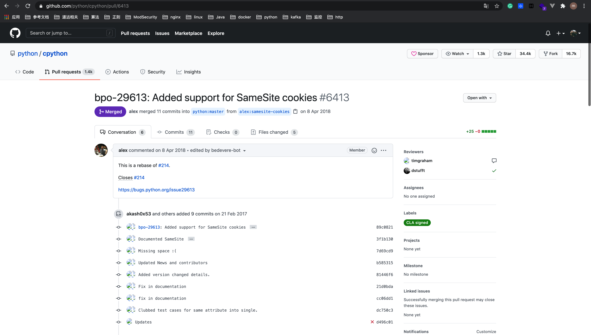

# 3. CSRF 防御

## 3.1 CSRF 防御方式
关于CSRF 的防御可以从2方面着手:
* 服务端(效果比较好，现在一般都是在服务端进行)
* 客户端

## 3.2 服务端 CSRF防御

服务端的CSRF方式方法很多样，但总的思想都是一致的，就是在客户端页面增加伪随机数。

### 方法1: cookie Hashing: 所有表单都包含同一个伪随机值

因为攻击者不能获得第三方的Cookie(理论上)，所以表单中的数据也就构造失败了

```python
from fastapi import FastAPI
from starlette.responses import Response

app = FastAPI()

@app.router("/get_a_page", status=200)
def get_a_page():
    # 页面数据
    content = {}
    value = "DefenseCSRF"
    response = Response(content=content, status_code=201)
    response.set_cookie("cookie", value, 3600)
    return response
```

### 方法2: 验证码

思路: 每次的用户提交都需要用户在表单中填写一个图片上的随机字符串，这个方案可以完全解决CSRF，但在易用性方面似乎不是太好。

`注意`: 听闻是验证码图片的使用涉及了一个被称为MHTML的Bug，可能在某些版本的微软IE中受影响。


### 方法3: One-Time Tokens: 不同的表单包含一个不同的伪随机值

在实现One-Time Tokens时，需要注意一点：就是“并行会话的兼容"。

如果用户在一个站点上同时打开了两个不同的表单，CSRF保护措施不应该影响到他对任何表单的提交。

考虑一下如果每次表单被装入时站点生成一个伪随机值来覆盖以前的伪随机值将会发生什么情况：用户只能成功地提交他最后打开的表单，因为所有其他的表单都含有非法的伪随机值。

必须小心操作以确保CSRF保护措施不会影响选项卡式的浏览或者利用多个浏览器窗口浏览一个站点。


* 1.令牌生成函数

```python
import random
import hashlib
import datetime


def gen_token():
    #这里为了方便，获取当前时间作为令牌，其实这是不安全的。
    now_time = datetime.datetime.now().strftime("%Y%m%d%H%M%S")
    random_num = random.randint(0,100)
    unique_num=str(now_time) + str(random_num)
    token = hashlib.md5(unique_num.encode())
    return token
```

* 2.然后Session令牌生成函数(gen_stoken())

```python
from starlette.requests import Request


def gen_stoken(request: Request):
    p_token = ""
    if request.session[SESSION_NAME] == p_token:
        # 没有值，赋值新值
        request.session[SESSION_NAME] = gen_token()
    else:
        # 继续使用旧值, 可能会有效期延长点
        pass 
```

* 3.WEB表单生成隐藏输入域的函数

```
<form method="POST" action="transfer">
　　<input type="text" name="toBankId">
　　<input type="text" name="money">
　　<input type="hidden" name="hash" value="token">
　　<input type="submit" name="submit" value="Submit">
</form>
```

### 方法4: 验证 HTTP Referer 字段

根据 HTTP 协议，在 HTTP 头中有一个字段叫 Referer，它记录了该 HTTP 请求的来源地址。

在通常情况下，访问一个安全受限页面的请求来自于同一个网站，比如需要访问 http://bank.example/withdraw?account=bob&amount=1000000&for=Mallory，用户必须先登陆 bank.example，然后通过点击页面上的按钮来触发转账事件。这时，该转帐请求的 Referer 值就会是转账按钮所在的页面的 URL，通常是以 bank.example 域名开头的地址。而如果黑客要对银行网站实施 CSRF 攻击，他只能在他自己的网站构造请求，当用户通过黑客的网站发送请求到银行时，该请求的 Referer 是指向黑客自己的网站。因此，要防御 CSRF 攻击，银行网站只需要对于每一个转账请求验证其 Referer 值，如果是以 bank.example 开头的域名，则说明该请求是来自银行网站自己的请求，是合法的。如果 Referer 是其他网站的话，则有可能是黑客的 CSRF 攻击，拒绝该请求。

这种方法的显而易见的好处就是简单易行，网站的普通开发人员不需要操心 CSRF 的漏洞，只需要在最后给所有安全敏感的请求统一增加一个拦截器来检查 Referer 的值就可以。特别是对于当前现有的系统，不需要改变当前系统的任何已有代码和逻辑，没有风险，非常便捷。

#### 验证 HTTP Referer 缺点

验证 HTTP Referer 这种方法并非万无一失。

Referer 的值是由浏览器提供的，虽然 HTTP 协议上有明确的要求，但是每个浏览器对于 Referer 的具体实现可能有差别，并不能保证浏览器自身没有安全漏洞。

使用验证 Referer 值的方法，就是把安全性都依赖于第三方（即浏览器）来保障，从理论上来讲，这样并不安全。事实上，对于某些浏览器，比如 IE6 或 FF2，目前已经有一些方法可以篡改 Referer 值。如果 bank.example 网站支持 IE6 浏览器，黑客完全可以把用户浏览器的 Referer 值设为以 bank.example 域名开头的地址，这样就可以通过验证，从而进行 CSRF 攻击。


### 方法5: Http头部: SameSite

防止 CSRF 攻击的办法已经有 CSRF token 校验和 Referer 请求头校验。为了从源头上解决这个问题，Google 起草了一份草案来改进 HTTP 协议，那就是为 Set-Cookie 响应头新增 SameSite 属性，它用来标明这个 cookie 是个“同站 cookie”，同站 cookie 只能作为第一方 cookie，不能作为第三方 cookie。SameSite 有两个属性值，分别是 Strict 和 Lax，下面分别讲解：

####  SameSite=Strict

Strict最为严格，完全禁止第三方 Cookie，只有当前网页的 URL 与请求目标一致，才会带上 Cookie，跨站点时，任何情况下都不会发送 Cookie。


比如说假如 b.com 设置了如下 cookie：

```
Set-Cookie: foo=1; SameSite=Strict
Set-Cookie: bar=2
```

你在 a.com 下发起的对 b.com 的任意请求中，foo 这个 cookie 都不会被包含在 Cookie 请求头中，但 bar 会。

**举例**

假如淘宝网站用来识别用户登录与否的 cookie 被设置成了 SameSite=Strict，那么用户从百度搜索页面甚至天猫页面的链接点击进入淘宝后，淘宝都不会是登录状态，因为淘宝的服务器不会接受到那个 cookie，其它网站发起的对淘宝的任意请求都不会带上那个 cookie。


#### SameSite=Lax

假如这个请求是同步请求（改变了当前页面或者打开了新页面）且同时是个 GET 请求（因为从语义上说 GET 是读取操作，比 POST 更安全），则这个 cookie 可以作为第三方 cookie。


比如说假如 b.com 设置了如下 cookie：


```
Set-Cookie: foo=1; SameSite=Strict
Set-Cookie: bar=2; SameSite=Lax
Set-Cookie: baz=3
```

当用户从 a.com 点击链接进入 b.com 时，foo 这个 cookie 不会被包含在 Cookie 请求头中，但 bar 和 baz 会，也就是说用户在不同网站之间通过链接跳转是不受影响了。

但假如这个请求是从 a.com 发起的对 b.com 的异步请求，或者页面跳转是通过表单的 post 提交触发的，则 bar 也不会发送。


| 请求类型 | 示例 | 正常情况 | Lax |
|----|----|----|----|
| 连接 | <a href="..."></a> | 发送 Cookie | 发送 Cookie |
| 预加载 | <link rel="prerender" href="..."/> | 发送 Cookie | 发送 Cookie |
| GET 表单 | <form method="GET" action="..."> | 发送 Cookie | 发送 Cookie |
| POST 表单 | <form method="POST" action="..."> | 发送 Cookie | 不发送 |
| iframe | <iframe src="..."></iframe> | 发送 Cookie | 不发送 |
| AJAX | $.get("...") | 发送Cookie | 不发送 |
| Image |  | 发送Cookie | 不发送 |


由此可见，设置了Strict或Lax以后，基本就杜绝了 CSRF 攻击。当然，前提是用户浏览器支持 SameSite 属性。

### SameSite=None

Chrome 计划将Lax变为默认设置。这时，网站可以选择显式关闭SameSite属性，将其设为None。

不过，前提是必须同时设置 Secure属性（Cookie 只能通过 HTTPS 协议发送），否则无效。


如下面的设置无效:
```
Set-Cookie: widget_session=abc123; SameSite=None
```


如下面的设置有效:
```
Set-Cookie: widget_session=abc123; SameSite=None; Secure
```


### 该用哪种方式
比如你的网站是一个少数人使用的后台管理系统，所有人的操作方式都是从自己浏览器的收藏夹里打开网址，那我看用 Strict 也无妨。

这种超多用户的、可能经常需要用户从别的网站点过来的网站，就不适合用 Strict :
* 如果你的网站是微博，用了 Strict 会这样：有人在某个论坛里发了帖子“快看这个微博多搞笑 http://weibo.com/111111/aaaaaa”，结果下面人都回复“打不开啊”；
* 如果你的网站是淘宝，用了 Strict 会这样：某微商在微博上发了条消息“新百伦正品特卖5折起 https://item.taobao.com/item.htm?id=1111111”，结果点进去顾客买不了

假如你的网站有用 iframe 形式嵌在别的网站里的需求，那么连 Lax 你也不能用，因为 iframe 请求也是一种异步请求。或者假如别的网站有使用你的网站的 JSONP 接口，那么同样 Lax 你也不能用，比如天猫就是通过淘宝的 JSONP 接口来判断用户是否登录的。

有时安全性和灵活性就是矛盾的，需要取舍。


### Python对SameSite的支持
Python 对SameSite属性的支持于2018年4月7日在 [Pull Request #6413](https://github.com/python/cpython/pull/6413/files) 中添加，如下:




