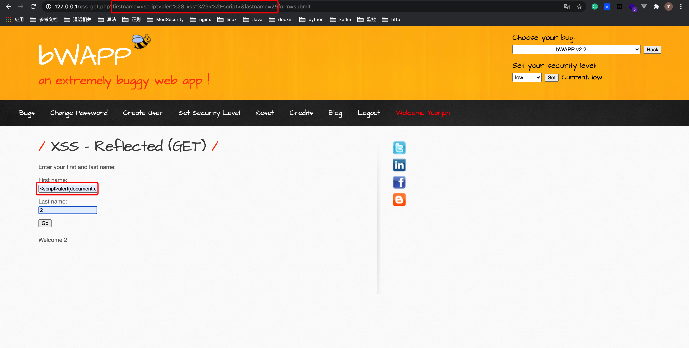
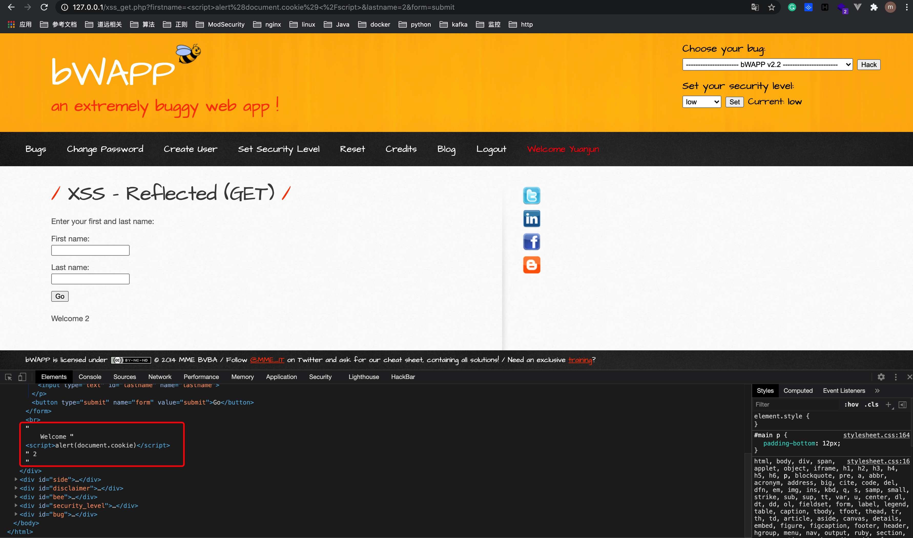
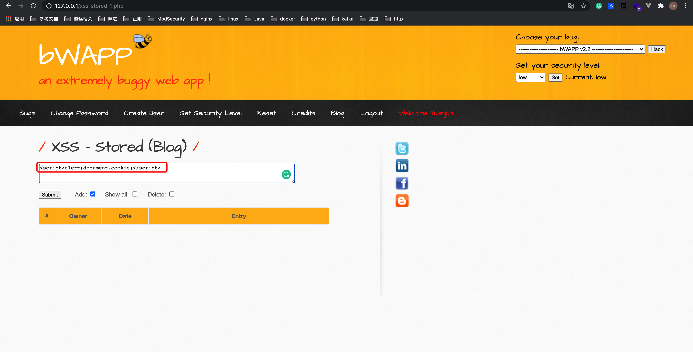
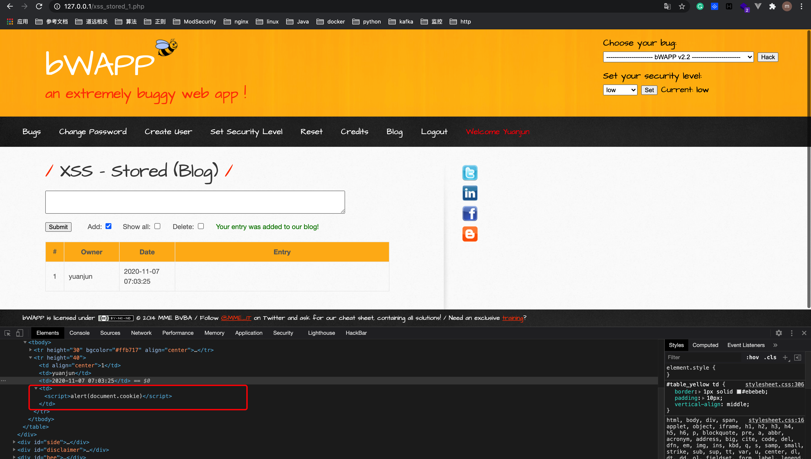
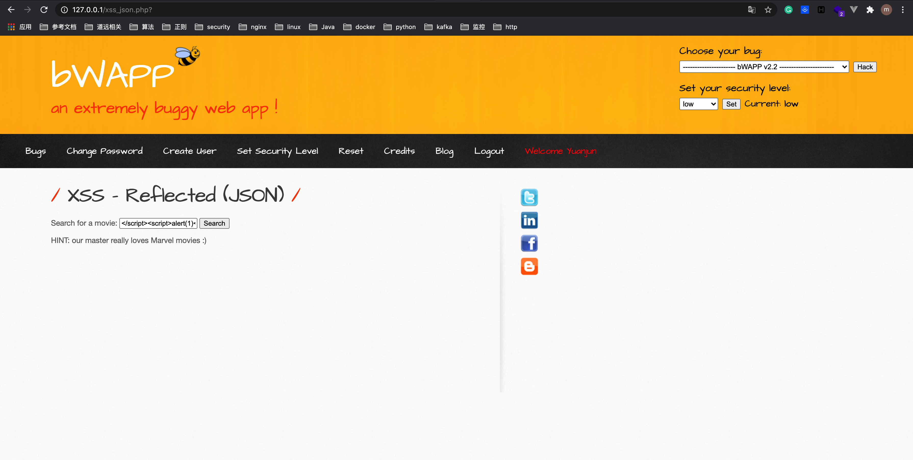
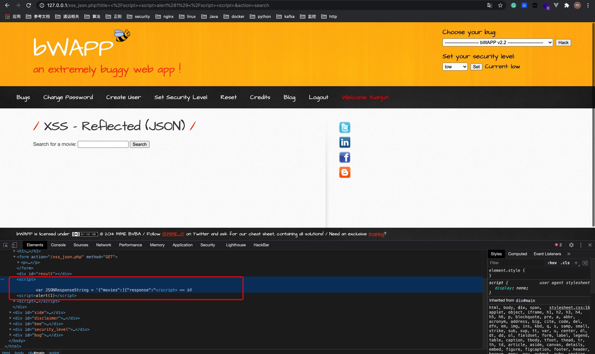

# 2. XSS 分类

## 2.1 XSS 分类
XSS有三类：
* 反射型XSS(非持久型)
* 存储型XSS(持久型)
* DOM XSS

## 2.2 反射型 XSS

发出请求时，XSS代码出现在URL中，作为输入提交到服务器端，服务器端解析后响应，XSS代码随响应内容一起传回给浏览器，最后浏览器解析执行XSS代码。

这个过程像一次反射，故叫反射型XSS。

### bWAPP 查看XSS反射



First name 填入: 
```html
<script>alert(document.cookie)</script>
```

点击 Go 后，页面弹出 cookie值。

查看源码:




## 2.3 存储型 XSS

### 存储型XSS vs.反射型XSS

存储型XSS和反射型XSS区别: 存储型XSS提交的代码会存储在服务器端（数据库，内存，文件系统等），下次请求目标页面时不用再提交XSS代码。

### bWAPP 存储型XSS




填入: 

```html
<script>alert(document.cookie)</script>
```

点击 Submit，页面弹出cookie值


查看源码:




## 2.4 DOM型 XSS

### DOM XSS vs. 反射型XSS vs. 存储型XSS

DOM XSS 的差别在于DOM XSS的代码并不需要服务器参与，触发XSS靠的是浏览器端的DOM解析，完全是客户端的事情。


### bWAPP DOM型XSS





填入: 

```html
</script><script>alert(1)</script><script>
```

点击 Search，页面弹出1


查看源码:



